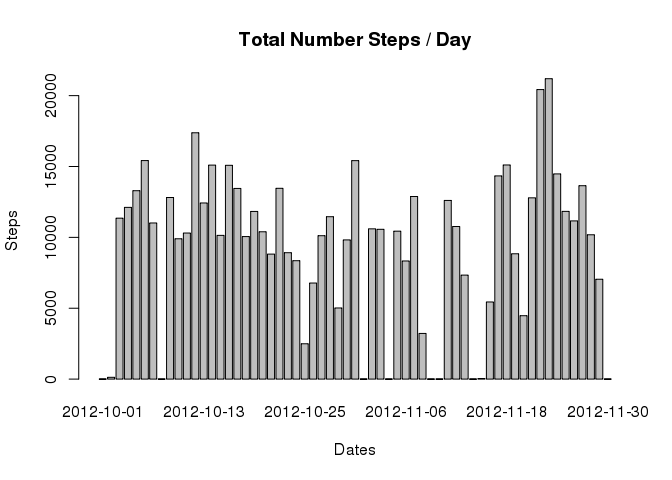

# Reproducible Research: Peer Assessment 1


## Loading and preprocessing the data

```r
#Unzip the data 
unzip('activity.zip')
#Reads the data into R
activityData<-read.csv('activity.csv')
#Casts date column into type 'Date'
activityData$date<-as.Date(activityData$date) 
```


## What is mean total number of steps taken per day?

```r
#Splits the data by date and sums up the steps
totalStepsPerDay<-sapply(split(activityData$steps,activityData$date),sum,na.rm=TRUE)
 
#Creates a data frame from a matrix of names(Dates) and values(Steps)
dataF<-data.frame(cbind(names(totalStepsPerDay),as.numeric(totalStepsPerDay)),stringsAsFactors = FALSE) 
names(dataF)<-c('Date','Steps')
dataF$Date<-as.Date(dataF$Date)
dataF$Steps<-as.numeric(dataF$Steps)
#Creates a plot
barplot(dataF$Steps,breaks=44,names.arg=dataF$Date,ylab='Steps',main='Total Number Steps / Day',xlab='Dates' )
```

```
## Warning in plot.window(xlim, ylim, log = log, ...): "breaks" is not a
## graphical parameter
```

```
## Warning in axis(if (horiz) 2 else 1, at = at.l, labels = names.arg, lty =
## axis.lty, : "breaks" is not a graphical parameter
```

```
## Warning in title(main = main, sub = sub, xlab = xlab, ylab = ylab, ...):
## "breaks" is not a graphical parameter
```

```
## Warning in axis(if (horiz) 1 else 2, cex.axis = cex.axis, ...): "breaks"
## is not a graphical parameter
```

 


```r
mn<-mean(dataF$Steps)
md<-median(dataF$Steps)
mn
```

```
## [1] 9354.23
```

```r
md
```

```
## [1] 10395
```

## What is the average daily activity pattern?


## Imputing missing values


## Are there differences in activity patterns between weekdays and weekends?
