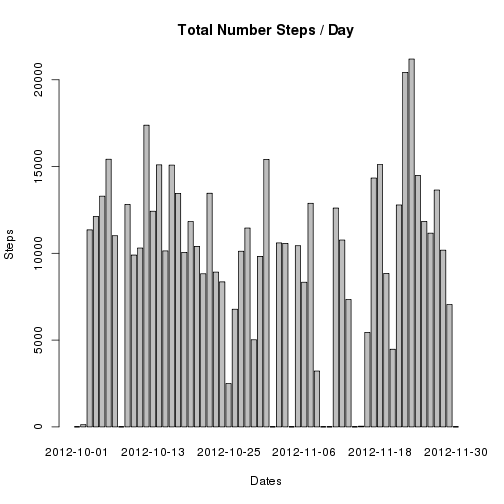
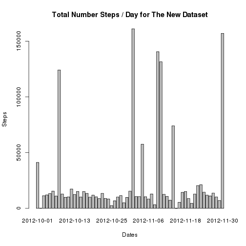

## Loading and preprocessing the data

```r
#Unzip the data 
unzip('activity.zip')
#Reads the data into R
activityData<-read.csv('activity.csv')
#Casts date column into type 'Date'
activityData$date<-as.Date(activityData$date) 
```


## What is mean total number of steps taken per day?

```r
#Splits the data by date and sums up the steps
totalStepsPerDay<-sapply(split(activityData$steps,activityData$date),sum,na.rm=TRUE)
 
#Creates a data frame from a matrix of names(Dates) and values(Steps)
dataF<-data.frame(cbind(names(totalStepsPerDay),as.numeric(totalStepsPerDay)),stringsAsFactors = FALSE) 
names(dataF)<-c('Date','Steps')
dataF$Date<-as.Date(dataF$Date)
dataF$Steps<-as.numeric(dataF$Steps)
#Creates a plot
barplot(dataF$Steps,names.arg=dataF$Date,ylab='Steps',main='Total Number Steps / Day',xlab='Dates' )
```

 


```r
mean(dataF$Steps)
```

```
## [1] 9354.23
```

```r
median(dataF$Steps)
```

```
## [1] 10395
```

## What is the average daily activity pattern?

```r
#Splits the data by date and sums up the steps
avgSteps<-sapply(split(activityData$steps,activityData$interval),mean,na.rm=TRUE)
#Creates a data frame from a matrix of names(Dates) and values(Steps)
dataF<-data.frame(cbind(names(avgSteps),as.numeric(avgSteps)),stringsAsFactors = FALSE) 
names(dataF)<-c('Interval','Steps') 
dataF$Steps<-as.numeric(dataF$Steps)
with(dataF,plot(Interval,Steps,type='l',main='Average Daily Activity pattern'))
```

 
##Maximum steps invterval

```r
with(dataF,max(Interval))
```

```
## [1] "955"
```
## Imputing missing values

```r
naStepsData<-activityData[ is.na(activityData$steps), ]
nrow(naStepsData)
```

```
## [1] 2304
```

```r
good<-complete.cases(activityData$steps)
noNaStepsData<-activityData[good,]
```
My Filling strategy I generated random steps between min and max steps

```r
naStepsData$steps<-as.integer(rnorm(nrow(naStepsData),min(noNaStepsData$steps):max(noNaStepsData$steps)))
#noNaStepsData
activityData[is.na(activityData$steps),1]<-naStepsData$steps
totalStepsPerDay<-sapply(split(activityData$steps,activityData$date),sum)
 
#Creates a data frame from a matrix of names(Dates) and values(Steps)
dataF<-data.frame(cbind(names(totalStepsPerDay),as.numeric(totalStepsPerDay)),stringsAsFactors = FALSE) 
names(dataF)<-c('Date','Steps')
dataF$Date<-as.Date(dataF$Date)
dataF$Steps<-as.numeric(dataF$Steps)
#Creates a plot
barplot(dataF$Steps,names.arg=dataF$Date,ylab='Steps',main='Total Number Steps / Day for The New Dataset',xlab='Dates' )
```

 

```r
mean(dataF$Steps)
```

```
## [1] 23894.95
```

```r
median(dataF$Steps)
```

```
## [1] 11458
```
## Are there differences in activity patterns between weekdays and weekends?

```r
activityData$Wday<-factor(weekdays(activityData$date) %in% c('Saturday','Sunday'),levels=c("FALSE","TRUE"),labels=c("weekday","weekend"))
weekDayData<-activityData[activityData$Wday=='weekday',]
weekEndData<-activityData[activityData$Wday=='weekend',]

weekDayData<-sapply(split(weekDayData$steps,weekDayData$interval),mean)
weekEndData<-sapply(split(weekEndData$steps,weekEndData$interval),mean)
weekDayData<-data.frame(cbind(names(weekDayData),as.numeric(weekDayData)),stringsAsFactors = FALSE) 
weekEndData<-data.frame(cbind(names(weekEndData),as.numeric(weekEndData)),stringsAsFactors = FALSE) 
names(weekDayData)<-c('Interval','Average')
names(weekEndData)<-c('Interval','Average')

par(mfrow=c(2,1))
#Plot for weekdays
with(weekDayData,plot(Interval,Average,type='l',ylab='Average Steps',main='Average Number of Steps on Weekdays',xlab='5-min Interval'))
#Plot for weekends
with(weekEndData,plot(Interval,Average,type='l',ylab='Average Steps',main='Average Number of Steps on Weekends',xlab='5-min Interval'))
```

 
